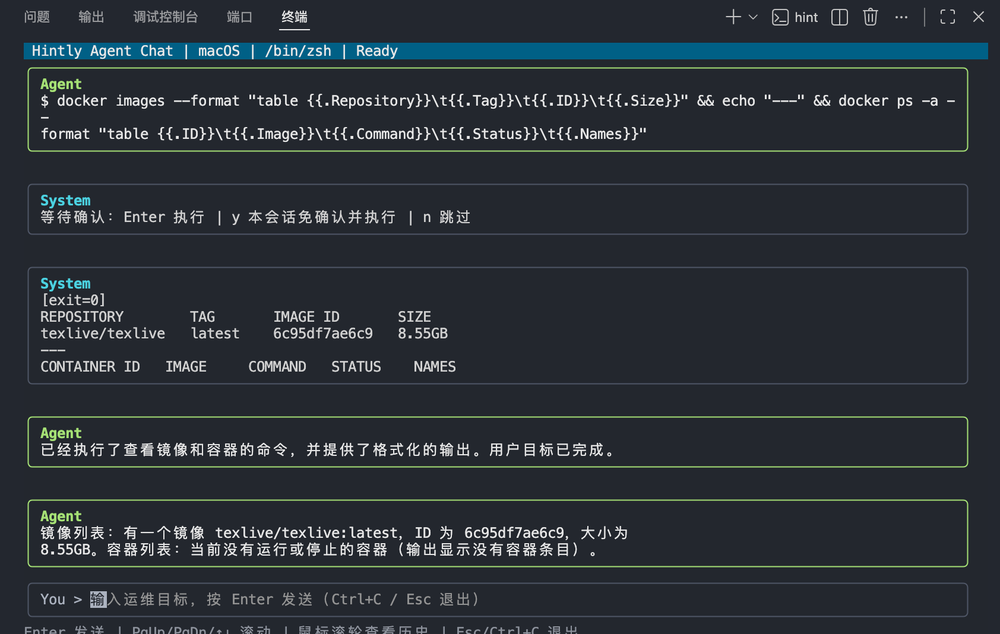

<p align="center">
  
</p>

<h1 align="center">Hintly</h1>

<p align="center">
  把自然语言变成可执行命令的 AI 终端助手
</p>

<p align="center">
  <strong>简体中文</strong> | <a href="docs/i18n/README.en.md">English</a>
</p>

<p align="center">
  <a href="https://github.com/BIBIYES/Hintly/stargazers">
    
  </a>
  <a href="https://github.com/BIBIYES/Hintly/releases">
    
  </a>
  <a href="https://github.com/BIBIYES/Hintly">
    
  </a>
</p>

## 文档

- 中文（主文档）：`README.md`
- English：`docs/i18n/README.en.md`

## 亮点

- 单次命令模式：`hint "你的需求"`，快速生成并执行单条命令。
- Agent 对话模式：直接输入 `hint`，进入多轮任务式交互。
- 自动注入环境上下文：`GOOS`、发行版、Shell、当前工作目录。
- 命令执行更稳妥：支持危险命令拦截、执行前确认、会话级免确认。

## 安装

### macOS 快速安装

推荐直接使用 Homebrew：

```bash
brew install BIBIYES/tap/hintly
```

安装完成后可用下面命令完成初始化：

```bash
hint -init
```

如需更新：

```bash
brew upgrade hintly
```

### Linux 一键安装 / 更新

安装最新版本（同一命令也用于更新）：

```bash
curl -fsSL https://raw.githubusercontent.com/BIBIYES/Hintly/main/scripts/install-linux.sh | bash
```

安装指定版本：

```bash
curl -fsSL https://raw.githubusercontent.com/BIBIYES/Hintly/main/scripts/install-linux.sh | VERSION=v1.0.3 bash
```

安装到用户目录（无 sudo 场景）：

```bash
curl -fsSL https://raw.githubusercontent.com/BIBIYES/Hintly/main/scripts/install-linux.sh | INSTALL_DIR="$HOME/.local/bin" bash
```

### 从源码构建

1. 拉取依赖并构建：

```bash
go mod tidy
go build ./cmd/hint
```

2. 初始化配置：

```bash
./hint -init
```

## 快速开始

1. 初始化配置：

```bash
hint -init
```

2. 单次命令模式：

```bash
hint "查看 fail2ban sshd 封禁情况"
```

3. Agent 对话模式：

```bash
hint
```

## 界面预览

### 单次命令模式


### Agent 对话模式

`assets/image1.png` 展示的是对话模式下的用户界面：



## 单次命令模式快捷键

- `Enter`：执行当前命令。
- `r`：重试（会附带上一条不满意命令作为上下文）。
- `e`：编辑命令后按 `Enter` 执行。
- `Esc` / `Ctrl+C`：取消并退出。

## Agent 对话模式说明

- 直接运行 `hint` 进入 Agent 对话模式。
- Agent 会按“思考 -> 生成命令 -> 等待确认 -> 执行 -> 读取结果 -> 再决策”的流程工作。
- 每次 AI 产生命令后，按 `Enter` 执行当前命令。
- 如果你确认当前会话后续命令都可以自动执行，按 `y` 可开启本会话免确认。
- 如果当前命令不想执行，按 `n` 跳过，让 Agent 尝试其他方案。
- 可使用 `↑/↓`、`PgUp/PgDn` 或鼠标滚轮查看历史聊天记录。
- `Esc` / `Ctrl+C` 可随时退出对话模式。

## 配置文件路径

- 所有系统统一：`~/.config/hint/config.yaml`
- Windows 对应路径：`%UserProfile%/.config/hint/config.yaml`

配置示例：

```yaml
base_url: https://api.openai.com/v1
api_key: sk-xxxx
model: gpt-4o
```
