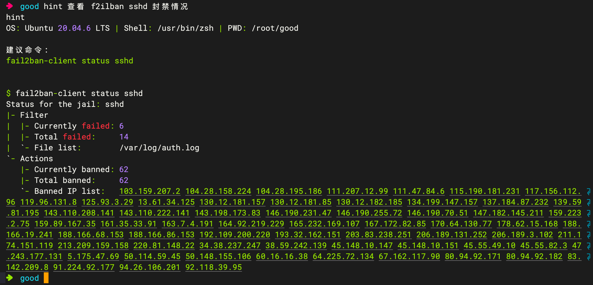

<p align="center">
  
</p>

<h1 align="center">Hintly</h1>

<p align="center">Assistant terminal IA qui transforme le langage naturel en commandes exécutables</p>

<p align="center">
  <a href="../../README.md">简体中文</a> | <a href="README.en.md">English</a> | <a href="README.ja.md">日本語</a> | <a href="README.ko.md">한국어</a> | <a href="README.es.md">Español</a> | <strong>Français</strong> | <a href="README.de.md">Deutsch</a> | <a href="README.ru.md">Русский</a> | <a href="README.pt-br.md">Português (BR)</a>
</p>

## Points forts

- Vous avez oublié une commande ? Demandez directement à `hint`.
- Convertit vos besoins en langage naturel en commandes prêtes à exécuter.
- Injecte automatiquement le contexte (`GOOS`, distribution, shell, dossier courant).
- Vérification manuelle obligatoire pour les commandes dangereuses.

## Démarrage rapide

```bash
go mod tidy
go build ./cmd/hint
./hint -init
./hint "vérifier l'état de bannissement sshd de fail2ban"
```

## Capture d'écran


